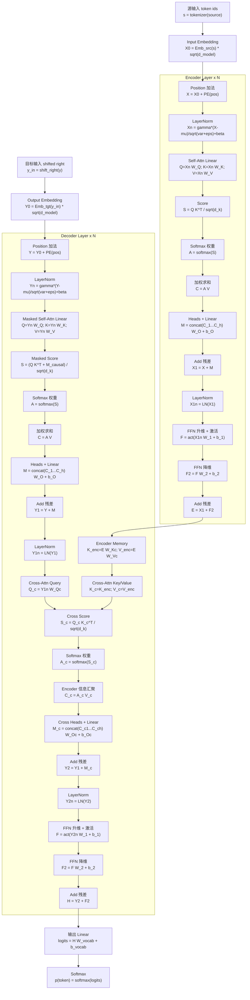

# Transformer 模型

<!-- graph-links:start -->
## 关联笔记
- 同目录笔记：[[Mamba模型|Mamba 模型]]
<!-- graph-links:end -->

## 一句话理解

Transformer 是一种以 **self-attention（自注意力）** 为核心的序列建模架构。它不依赖 RNN 那样逐步递归处理序列，而是让序列中的每个 token 同时查看其他 token，并根据相关性聚合信息。

它的核心优势是：训练时并行度高，长距离依赖路径短，能灵活建模 token 之间的全局关系。现代大语言模型、BERT 类编码器、ViT 视觉模型和很多多模态模型都建立在 Transformer 变体之上。

> [!note] 关键来源
>
> Transformer 来自 2017 年论文 **Attention Is All You Need**。论文提出完全基于 attention 的 encoder-decoder 架构，用 self-attention 和 feed-forward network 替代 RNN / CNN 作为主要序列建模模块。

## 背景：Transformer 解决了什么问题

在 Transformer 之前，序列任务常用 RNN、LSTM、GRU 或 CNN。RNN 的问题是天然按时间步顺序计算：第 $t$ 个位置依赖第 $t-1$ 个隐藏状态。这样做符合序列直觉，但训练并行度差，长距离依赖也容易衰减。

Attention 的想法是：当模型处理一个位置时，不必只依赖上一个隐藏状态，而是可以直接对整个序列中相关位置分配权重。Transformer 把这个思想推到核心位置：整个模型主要由 attention 和逐位置前馈网络组成。

## 完整计算步骤流程图

下面的图按原始 Transformer 的 **encoder-decoder** 结构来画，颗粒度接近经典架构图，但每个计算节点都写出对应公式。现代 decoder-only 大语言模型可以看成主要保留右侧 decoder 的 masked self-attention 和 MLP，并去掉 encoder / cross-attention。

## 每一步在做什么

图中已经把每个计算节点的主要公式写出来了，下面只解释每一步的作用。

1. **源输入 token ids**：源句子或输入序列先被 tokenizer 切成整数 id，作为 encoder 的输入。

2. **Input Embedding + Position**：embedding 把离散 id 查成连续向量，position 信息补上 token 的顺序。没有位置项时，self-attention 只知道 token 集合，不知道先后顺序。

3. **Encoder LayerNorm**：在进入 self-attention 前稳定每个 token 的通道尺度，避免深层堆叠时数值分布漂移。

4. **Encoder Self-Attention 的 Q、K、V**：encoder 用同一份输入表示生成 $Q$、$K$、$V$。这一步让每个源 token 都能和其他源 token 建立关系。

5. **Score、Softmax、加权求和**：score 衡量 token 之间的匹配程度，softmax 把分数变成权重，再用权重汇聚 $V$。这就是 self-attention 真正完成“从上下文取信息”的地方。

6. **Heads + Linear**：多个 head 各自在不同子空间做 attention，最后拼接并线性投影回模型维度。

7. **Encoder 残差与 FFN**：attention 输出先和原输入相加，再进入 FFN。attention 负责 token 间交互，FFN 负责每个 token 内部的非线性特征变换。

8. **Encoder Memory**：encoder 最终输出 $E$ 会作为 decoder 的外部记忆。cross-attention 不直接看源 token ids，而是看 encoder 处理后的 $K_{enc}$ 和 $V_{enc}$。

9. **目标输入 shifted right**：decoder 训练时输入的是右移后的目标序列，保证当前位置只能基于已知历史预测下一个 token。

10. **Output Embedding + Position**：目标端 token 同样要先变成向量，并加入位置项，形成 decoder 的输入表示。

11. **Masked Self-Attention**：decoder 先在目标端内部做 self-attention，但加入 causal mask，屏蔽未来 token，避免训练时偷看答案。

12. **Decoder 第一段残差**：masked self-attention 的结果加回目标端输入，保留原始目标历史表示。

13. **Cross-Attention**：decoder 用自己的隐藏状态生成 query，用 encoder memory 生成 key/value。它的作用是让当前正在生成的目标 token 去源序列中查找相关信息。

14. **Decoder 第二段残差**：cross-attention 汇聚到的源端信息加回 decoder 表示，使目标端同时包含“已生成历史”和“源序列上下文”。

15. **Decoder FFN**：对每个目标位置独立做非线性变换，进一步加工 attention 汇聚后的特征。

16. **输出 Linear + Softmax**：最终 hidden states 通过词表线性层变成 logits，再用 softmax 得到每个候选 token 的概率。生成时通常取概率最高或按采样策略选择下一个 token。

## Scaled Dot-Product Attention 与 Multi-Head Attention

Transformer 最基础的 attention 形式是 scaled dot-product attention：

$$
\text{Attention}(Q, K, V) = \text{softmax}\left(\frac{QK^\top}{\sqrt{d_k}}\right)V
$$

其中 $Q$ 是 Query，$K$ 是 Key，$V$ 是 Value，$d_k$ 是 key 的维度。除以 $\sqrt{d_k}$ 是为了避免点积数值太大，使 softmax 过早变得极端。

单个 attention head 只能从一个表示子空间看 token 关系。Multi-head attention 会并行做多组 attention：

$$
\text{head}_i = \text{Attention}(QW_i^Q, KW_i^K, VW_i^V)
$$

$$
\text{MultiHead}(Q,K,V) = \text{Concat}(\text{head}_1,\dots,\text{head}_h)W^O
$$

多头机制的意义是：不同 head 可以关注不同类型的关系。例如，有的 head 更关注局部邻近词，有的 head 更关注句法依赖，有的 head 更关注实体引用或长距离对应关系。

在现代大模型中，具体顺序可能从原论文的 post-norm 变为更常见的 pre-norm；激活函数、归一化、位置编码、attention 变体也会有很多工程改造。但核心仍是 attention + MLP + 残差堆叠。

## 位置编码为什么必要

Self-attention 本身只看 token 之间的相似度，不天然知道 token 的顺序。如果不加入位置信息，模型很难区分“猫追狗”和“狗追猫”。

因此 Transformer 需要位置编码或位置偏置。常见做法包括：

- 原论文中的 sinusoidal positional encoding。
- 可学习绝对位置 embedding。
- 相对位置编码。
- RoPE（Rotary Position Embedding），常见于现代 decoder-only LLM。
- ALiBi 等面向长上下文外推的位置偏置。

位置机制不是装饰项，而是决定模型如何理解顺序、距离和上下文长度的重要设计。

## Encoder、Decoder 与常见变体

原始 Transformer 是 encoder-decoder 架构，主要面向机器翻译：

- **Encoder**：读入源序列，每层包含 self-attention 和 feed-forward network。
- **Decoder**：自回归生成目标序列，每层包含 masked self-attention、cross-attention 和 feed-forward network。
- **Cross-attention**：decoder 用自己的 query 去查询 encoder 输出的 key/value，从源序列中取信息。

后来常见模型把这个结构拆成不同变体：

- **Encoder-only**：例如 BERT，适合理解、分类、抽取、检索表征。
- **Decoder-only**：例如 GPT 类模型，适合自回归文本生成。
- **Encoder-decoder**：例如 T5、BART，适合输入到输出的转换任务。

## Masked Self-Attention

自回归生成时，模型不能偷看未来 token。Decoder-only 模型会使用 causal mask，让第 $t$ 个位置只能看到 $1$ 到 $t$ 的历史位置。

这使得训练时可以一次并行处理整个序列，但每个位置的 attention 权重只覆盖合法历史；推理时则逐 token 生成，并缓存历史 key/value 以避免重复计算。

## 优势与代价

Transformer 的主要优势：

- 能直接建模任意两个位置之间的依赖。
- 训练并行度高，比 RNN 更适合 GPU / TPU。
- 架构通用，能迁移到文本、图像、语音、多模态等任务。
- 扩展规律清晰，大规模预训练效果强。

Transformer 的主要代价：

- 标准 full attention 的计算和显存随序列长度近似二次增长。
- 自回归推理需要 KV cache，长上下文时缓存开销大。
- attention 权重不等于完整解释，不能简单把高权重当作因果原因。
- 没有合适的位置机制时，对顺序和长度外推会不稳定。

## 和 Mamba 的关系

[[Mamba模型|Mamba]] 和 Transformer 都是序列模型 backbone，但它们处理历史信息的方式不同。

Transformer 保留历史 token 的 key/value，让当前 token 可以显式回看历史位置；Mamba 把历史压缩进状态，通过状态更新传播信息。前者更像“随时查阅历史表”，后者更像“不断维护一份压缩摘要”。

因此二者的差异主要不是“谁先进谁落后”，而是效率与表达方式的取舍：

- Transformer 更擅长显式 token-token 交互。
- Mamba 更强调长序列线性扩展和固定状态推理。
- 一些新架构会尝试把 attention、SSM、卷积或门控机制混合使用。

## 学习抓手

理解 Transformer 可以抓住三句话：

1. Query-Key-Value attention 决定每个 token 从哪里取信息。
2. Multi-head attention 让模型从多个关系子空间同时看序列。
3. 堆叠 attention、MLP、残差和归一化以后，模型就能形成强大的通用表征与生成能力。

## 参考资料

- Vaswani, A., Shazeer, N., Parmar, N., Uszkoreit, J., Jones, L., Gomez, A. N., Kaiser, L., & Polosukhin, I. **Attention Is All You Need**. arXiv:1706.03762.
- NeurIPS paper PDF: <https://papers.neurips.cc/paper/7181-attention-is-all-you-need.pdf>
