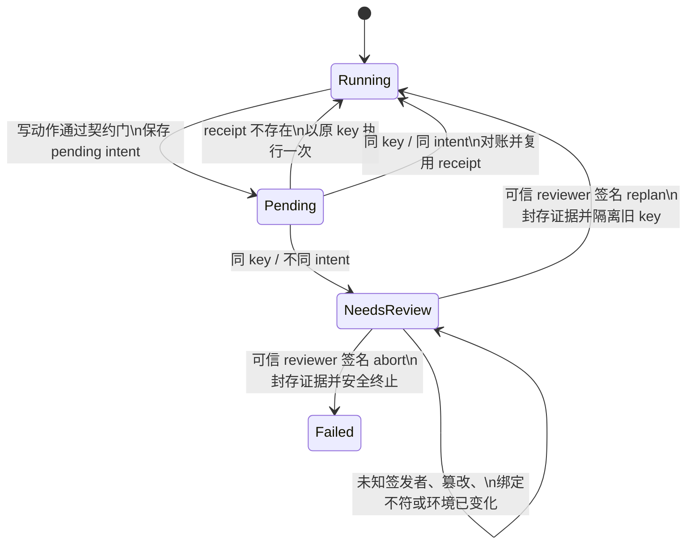

# 长任务检查点与幂等恢复

## 本节目标

- 设计能跨进程恢复的环境任务 checkpoint。
- 处理副作用与 checkpoint 之间的 crash window。
- 用幂等键、intent digest 和 receipt 防止重复执行。

## 为什么聊天历史不能恢复长任务

长任务会遇到进程退出、浏览器重启、机器休眠、网络超时、人工等待和环境被其他参与者改变。聊天历史可能描述“已点击”或“已修改”，却无法证明外部副作用是否发生，也不保存精确批准、预算、环境版本和幂等 receipt。恢复时重放自然语言步骤可能造成重复下单、重复发送或覆盖新文件。

## 怎样实现

checkpoint 至少保存：

- `run_id`、外部 task/version 与 policy/version 的指纹、明确 phase 和 stop reason；
- 当前计划游标、已用 proposal/step/time/cost 预算；
- 环境实例 ID、状态指纹、adapter generation 与最后 observation version，而非假装保存了整个真实世界；
- 待执行 action 的规范化 intent digest、风险、环境前置状态与完整签名 approval evidence；
- 已执行写动作的 idempotency key、外部 receipt 完整身份/指纹和结果摘要；
- 允许作用域、身份、策略版本与恢复前必须重验的前置条件；
- verifier 证据对应的 environment version。

普通 SHA-256 checksum 只能发现随机损坏，不能证明 checkpoint 来自可信 runtime：能修改 payload 的攻击者也能重新计算 checksum。课程示例因此同时使用标准库 HMAC-SHA256，签名密钥由调用方在 checkpoint 之外管理，既不写入 checkpoint，也不打印到输出；恢复还必须传入外部固定的 scenario，并核对 schema、task/version、policy/version、权限、allowlist、初态与 verifier 预期的整体指纹。

**HMAC 证明真实性与完整性，不证明新鲜度。** 旧 checkpoint 的 HMAC 仍然有效，单靠签名不能阻止回滚到较早状态。示例用 checkpoint 之外的 `CheckpointGenerationStore` 为 `(task_id, run_id, environment_instance_id)` 维护单调高水位；checkpoint 先验证当前 Sandbox/RunState schema、跨对象不变量与 JSON 可序列化性，再推进 generation，恢复只接受与外部高水位完全相等的版本，缺少该存储也失败关闭。这里的 store 仍是内存教学替身；生产实现必须是独立、耐久、受访问控制且支持原子比较交换的存储，并把“checkpoint 内容持久化”和“高水位提交”设计成同一原子协议，否则进程可能在两者之间崩溃并丢失最后恢复点。HMAC 也不能抵御密钥泄露或可信签名进程被攻陷，生产系统仍需密钥轮换、访问控制和审计。

### 并发恢复还需要运行所有权

外部 generation 高水位解决“旧 checkpoint 不能回滚覆盖新 checkpoint”，却不能决定两个恢复进程中谁可以继续执行。生产 runtime 还应沿用 [[Agent 核心/05-长任务检查点、恢复与幂等#Lease 与并发恢复|Agent 核心的 lease 与并发恢复]]：持久记录 `owner_worker`、`lease_version`、`expires_at` 与 `state_version`；取得 lease 后，每次推进 checkpoint 或调用 adapter 前重新验证当前 lease，并用 `(expected_state_version, expected_lease_version)` 原子提交。旧 worker 的迟到 checkpoint 必须被拒绝；若 adapter 支持条件写或 operation token，还应传入单调 lease/revision 作为提交栅栏。否则 lease 只能避免多数重复调度，不能证明跨环境写操作互斥。

课程内存 runtime 刻意没有实现跨进程 lease 或 durable compare-and-set，因此 103 项测试证明的是单进程控制合同和故障路径，不证明两个恢复 worker 的并发安全。迁移真实浏览器、桌面、shell 或代码执行 adapter 前，应增加双 worker 争用、lease 到期后旧结果迟到、adapter 拒绝过期 token 以及同一 receipt 对账的集成测试。

恢复到外部环境时，版本号相同并不等于状态相同。示例先要求环境实例 ID 一致；随后只接受 checkpoint 中的精确状态，或可由唯一 pending write 确定性推导出的“一次提交”状态。相同版本但文件/receipt 不同、相同内容但实例不同，以及无法由 pending intent 证明的多步漂移都失败关闭。真实 adapter 还应使用自身权威的 revision/etag、业务对象 ID 和事务日志，而不是照搬内存指纹。

典型 crash window：

| 崩溃位置 | 已知事实 | 恢复动作 |
| --- | --- | --- |
| 提议前 | 上一 checkpoint 完整 | 重新观察再决定 |
| action 落盘前 | 有 intent，无副作用证据 | 用同幂等键执行或查询 |
| 外部成功后、receipt 未持久化 | 结果不确定 | 先按 key/业务 ID 查询，不盲重试 |
| receipt 落盘后、状态未推进 | 有成功证据 | 重放确定性 state transition，不重复副作用 |

幂等缓存应绑定 `(idempotency_key, intent_digest)`：同 key/同 intent 返回原 receipt；同 key/不同 intent 必须冲突。adapter receipt 是权威证据，runtime cache 只是可重建副本：cache 缺失但 adapter receipt 完整时可以恢复；adapter receipt 缺失，或 cache 与 adapter 的 namespace/version/receipt ID/digest/result 任一漂移时，都不能用旧 cache 宣称 replay 成功。只比较 action ID 不够，因为新进程可能生成新 ID；只比较 key 也会把错误参数悄悄当成旧请求。

审批过期与 checkpoint 损坏是不同问题。恢复时仍应验签并载入过期 approval evidence，让 operator 看见 pending、trace 与 receipt；但未提交 pending 必须保持冻结，不能自动执行。课程 runtime 的最小 liveness 路径是由控制面签发一份 fresh、精确绑定同一 action/key/intent 和当前环境实例/指纹/generation 的 approval，`refresh_pending_approval` 验证后替换 active evidence，并把旧证据封存在 trace。若 receipt 已证明写入在崩溃前提交，则只做对账，不要求再次执行副作用。

这里有一个刻意保留、必须显式说明的信任边界：内存 `Sandbox` 是与 runtime 同进程、同步调用的受信 adapter 替身，因此“精确单次 post-state + 同 intent 的 adapter receipt”被视为 runtime 调用已提交的证据。它的 receipt 没有 approval fingerprint、adapter 侧授权决定或可信 commit timestamp，不能证明一个绕过 runtime 的调用发生在批准到期前。真实异步或可被其他调用方访问的 adapter 必须在权威 receipt 中绑定批准/能力摘要、提交时间与业务对象身份，并由 adapter 自己执行 expiry；缺少这些字段，或提交时间晚于批准边界时，应进入人工 review，而不能沿用本示例的自动对账分支。

### Receipt 冲突不是普通异常

adapter 若返回“同一幂等键、不同 intent digest”，runtime 无法自动判断是旧调用方复用了 key、外部服务串单、存储损坏，还是待恢复动作本身有误。课程 runtime 因此不会弹出 pending intent 后继续：它进入显式 `needs_review`，冻结新的 proposal 和 pending 执行，同时保留原 action/intent、包含 adapter namespace/version/receipt ID/result 的完整冲突 receipt、其规范化 fingerprint、环境版本和 trace。

*图 1　Receipt intent 冲突的冻结与人工对账状态机。*

> [!note] 图示可访问性、来源与再生成
> **替代文本：** 写动作先进入 Pending；无 receipt 时只执行一次，同 key 同 intent 时复用已有 receipt。若同 key 对应不同 intent，runtime 进入 NeedsReview 并冻结。只有受信 reviewer 针对当前 task、run、policy、action、key、两份 digest、完整 receipt fingerprint 和环境版本签名，且 runtime 在落决定前重读到完全相同的权威 receipt，才能选择 replan 或 abort；其他记录保持冻结。
>
> **来源与许可：** 课程根据本目录 `environment_runtime.py` 的确定性状态机原创绘制，未复制外部图形。
> **再生成：** 图由本 Markdown 内 Mermaid 源码实时渲染；修改状态或迁移后重新打开笔记或运行网站构建即可。

`replan` 并不是“相信其中一个 receipt”：它把冲突 key 加入隔离集合，把完整 pending/receipt/人工决定封存在 review case，回到 `running` 后要求重新观察并以新 key 规划；`abort` 则进入 `failed`，同样保留三份证据。人工决定由独立 reviewer HMAC 签名，并绑定当前环境版本与完整 receipt fingerprint；runtime 在消费决定前重新读取 adapter 的权威 receipt，任一字段漂移都维持冻结。开放 review case、完整审批证据和已消费的 approval/reviewer nonce 都进入 checkpoint；恢复含这些证据的状态时必须重新提供相应 trust root，否则失败关闭。

恢复后必须重新观察外部环境。页面 URL、窗口焦点、文件 hash、base commit 或账号身份变化时，旧 locator、批准和 verifier 都可能失效；runtime 应暂停、重规划或人工接管。

## 常见失败

- checkpoint 只有模型消息，没有策略版本、权限、receipt 和状态校验。
- 把有效 HMAC 误当成“最新 checkpoint”，没有外部单调高水位，导致旧状态可被回滚重放。
- 在 schema/跨状态/序列化检查前推进高水位，签出不可恢复 checkpoint 或让最后好版本过早失效。
- 把过期 approval 当 checkpoint 认证失败，导致证据也无法读取；或反过来载入后直接自动执行。
- runtime cache 掩盖 adapter receipt 删除或完整字段漂移，虚构 `replayed=true`。
- 只绑定 environment version，不绑定实例与状态指纹；同版本的另一台环境或被旁路修改的状态获得旧批准。
- 先执行外部写，再生成随机幂等键；重启后无法关联旧请求。
- 每次重试产生新 key，所谓幂等形同虚设。
- 同 key/不同参数仍返回成功，掩盖调用方错误。
- 同 key/不同 intent 只记一条 error 后删除 pending，既丢失对账证据又让 Agent 继续写。
- 人工点击“继续”却不绑定完整 receipt fingerprint、冲突双方 digest、环境版本和一次性 nonce；或者签发后不重读权威 receipt，旧决定可以跨任务重放或覆盖对账漂移。
- 恢复后直接重放坐标/命令，不检查页面、焦点、文件或 commit。
- 使用 `assert` 保护运行时不变量，`python -O` 后检查消失。

## 怎样验证

在每个 crash window 注入故障，恢复后核对写入次数与外部终态。分别验证随机损坏、篡改后重算普通 checksum、错误 HMAC 密钥、旧 checkpoint generation、缺失外部高水位、未知字段以及外部 task/策略版本变化都失败关闭；非法当前状态不得推进高水位。另测同版本不同状态、同状态不同实例，以及已审批 pending 墙钟过期后“可恢复证据、不可执行、fresh exact approval 可解冻”。以同 key/同 intent 和同 key/不同 intent 分别测试 replay 与冲突；前者在策略要求时仍需新审批，且 adapter receipt 删除或 cache/adapter 完整字段漂移不得 replay；后者必须保留 pending 并进入 `needs_review`，此时任何新 proposal 或直接执行都被拒绝。再验证未知 reviewer、签名篡改、签发后环境变化和完整 receipt 漂移维持冻结，可信 `replan` 使用新 key 后能重新验证并完成，可信 `abort` 能终止且 checkpoint 仍保留证据。完成证据必须绑定最后一次环境变更后的版本，并能在 trace 中找到同版本的通过型 verifier 事件。

## 实践任务

运行 [[环境型Agent/examples/environment_runtime.py|environment_runtime.py]]。先阅读 `test_approved_committed_write_recovers_with_signed_evidence`：它在已审批写入由 adapter 提交后、runtime receipt 落盘前注入崩溃，恢复时同时验证 approval trust root、环境迁移和 receipt，并证明 `write_count` 仍为 1。再阅读 `test_external_high_water_mark_rejects_checkpoint_rollback`、`test_receipt_drift_invalidates_signed_reconciliation` 和两个可信 `replan/abort` 测试，分别理解回滚、对账竞态、恢复 liveness 与证据保全。最后新增一个“两个恢复进程并发争用同一 generation”的负向用例，并说明生产存储需要怎样的原子比较交换。

## 参考

- [[Agent 核心/05-长任务检查点、恢复与幂等|长任务检查点、恢复与幂等]]：通用 crash-window 与 receipt 模型。
- [OSWorld](https://arxiv.org/abs/2404.07972)：任务初态和执行式结果验证说明环境恢复不能只依赖对话文本。
- [SWE-bench 官方 harness](https://github.com/SWE-bench/SWE-bench)：以固定仓库环境执行评测的实例。
