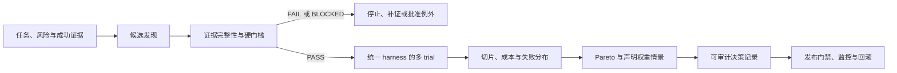

# 现代 LLM 能力与模型选择

## 课程定位

模型选择不是抄一张排行榜，也不是默认购买“最大模型”。它是一个受约束的工程决策：先把任务、风险和部署边界写成**能力契约与硬门槛**，再让候选模型在同一 harness、同一数据和同一配置下完成多次 trial，最后分析质量、成本、延迟与风险之间的 Pareto 权衡。

本课程不维护任何模型名次。模型目录、价格、上下文上限、区域可用性和预览状态都属于易变事实；课程只教授可迁移的选择方法。

> [!info] 动态事实边界
> 资料复核日期为 2026-07-22。供应商模型 ID、能力、配额、价格、数据政策与退役日期必须在决策当日从官方目录、模型卡、合同和实际探测中重新核验，并保存证据 URI、时间与配置。广告中的上下文窗口是接入上限，不等于任务上的有效上下文能力；公开 benchmark 是候选发现证据，不是上线结论。
>
> `latest`、预览别名和固定版本并不具有相同的变更语义；即使某个模型 ID 对应固定权重，路由、安全层或服务基础设施仍可能改变可观察行为。记录请求的标识、响应实际返回的模型/版本（接口提供时）、端点/区域与 adapter 版本，并把供应商生命周期或运行时变更视为重新探测和回归的触发器。

## 学习目标

- 把业务任务转换为输入/输出、推理、上下文、结构化输出、工具和模态能力契约。
- 区分“接口声称支持”与“在本任务、目标配置下可靠工作”。
- 为 embedding、生成模型和多模态模型分别选择匹配任务的评测对象与指标。
- 用数据驻留、保留、训练用途、可部署环境、许可证、预算和延迟构造硬门槛。
- 用全局唯一 `trial_id` 在同一 case 上运行多次 trial，报告失败分布、成本与有限样本统计，而非把不同 case 的数量误当重复次数。
- 先淘汰不合格候选，再在合格集合内计算可解释分数、Pareto 前沿和权重敏感性。
- 形成可复核的模型决策记录，并为版本升级设置回归与回滚条件。

## 前置知识

- 能读写 JSON，并会在 PowerShell 7 中运行 Python 标准库脚本与 unittest。
- 理解 HTTP API、timeout、JSON schema 与基本统计；不要求已经接入某个供应商。
- 本课位于 LLM 应用基础入口，可与 [[提示词工程/00-目录|提示词工程]]、[[上下文工程/00-目录|上下文工程]] 和 [[LLM API集成/00-目录|LLM API 集成]] 并行学习；做真实候选探测时再补 provider adapter、usage 与重试。
- 若选择 embedding，再按需进入 [[Embedding/00-目录|Embedding]]；若选择 Agent 模型，再用 [[Tool Calling（含 Function Calling）/00-目录|Tool Calling]] 验证完整动作契约。

## 推荐学习顺序

| 顺序 | 课程 | 关键产物 |
| --- | --- | --- |
| 1 | [[现代LLM能力与模型选择/01-能力契约与选择对象\|能力契约与选择对象]] | 一页任务—能力契约 |
| 2 | [[现代LLM能力与模型选择/02-推理、有效上下文与结构化输出\|推理、有效上下文与结构化输出]] | 三类可执行验收用例 |
| 3 | [[现代LLM能力与模型选择/03-工具支持与Agent运行时适配\|工具支持与 Agent 运行时适配]] | tool/runtime 兼容矩阵 |
| 4 | [[现代LLM能力与模型选择/04-多模态、Embedding与专用模型\|多模态、Embedding 与专用模型]] | 模态流水线与 embedding 评测集 |
| 5 | [[现代LLM能力与模型选择/05-硬门槛、隐私与部署边界\|硬门槛、隐私与部署边界]] | 可审计 gate 表 |
| 6 | [[现代LLM能力与模型选择/06-任务级多Trial评测\|任务级多 Trial 评测]] | 冻结 case、trial 与指标协议 |
| 7 | [[现代LLM能力与模型选择/07-Pareto权衡与敏感性分析\|Pareto 权衡与敏感性分析]] | 前沿、权重扰动与决策记录 |
| 8 | [[现代LLM能力与模型选择/08-项目-可审计模型选择评分卡\|项目：可审计模型选择评分卡]] | 离线评分卡、失败用例和测试证据 |

建议投入 12–16 小时：前 7 课各 60–90 分钟，项目与复盘 3–5 小时。

## 从候选到发布的证据流

图中的顺序是证据依赖，不是瀑布流程：任务、政策、候选或运行时发生变化时，回到受影响的上游步骤重跑；`BLOCKED` 代表证据缺失，不能被总分抵消。

## 学习产物

完成课程后应保留五份版本化产物：

1. `task contract`：任务分布、输入输出、风险和成功证据；
2. `candidate evidence`：模型 ID、接口能力、模型卡、政策、价格，以及可解析的 verified/blocked、owner、expiry 与缺失项；
3. `eval protocol`：冻结 case、trial 次数、grader、配置和停止规则；
4. `decision report`：gate 结果、指标分布、Pareto 前沿、敏感性和例外批准；
5. `release guard`：选定版本、回归阈值、灰度、监控与回滚条件。

## 掌握标准

- [ ] 能解释为什么“支持 1M context”不能证明长文任务可靠。
- [ ] 能把 JSON schema/tool/multimodal 支持写成可运行的契约测试。
- [ ] 能为 embedding 选择与检索任务匹配的查询、语料、相关性和延迟指标。
- [ ] 能在比较分数前执行隐私、部署、能力、成本与延迟硬门槛。
- [ ] 能区分 `case_id` 与全局唯一 `trial_id`，并验证每个候选、每个 case 都达到预注册重复次数。
- [ ] 能说明小样本 nearest-rank p95 只是已记录样本的描述，不能证明稳定尾延迟。
- [ ] 能区分总分、Pareto 前沿和敏感性分析分别回答什么问题。
- [ ] 能拒绝“公开榜单第一，所以直接上线”的论证。
- [ ] 能运行项目测试，并说明 fixture 中预期被 gate 淘汰和被 Pareto 支配的候选。

## 与其他课程的关系

- [[评测体系/00-目录|评测体系]] 提供 task、trial、grader、trace、outcome 的完整方法；本课程把它收敛到模型候选决策。评分卡通过后，使用 [[评测体系/02-方法与质量/08-离线到线上证据交接与回归闭环|离线到线上证据交接与回归闭环]] 将摘要、发布门、运行证据和人工分诊连接起来。
- [[Benchmark设计/00-目录|Benchmark 设计]] 解释公共比较协议；本课程强调私有任务分布和部署约束优先。
- [[LLMOps/00-目录|LLMOps]] 接管模型版本发布、灰度、监控与回滚。
- [[RAG/00-目录|RAG]] 与 [[Agent 核心/00-目录|Agent 核心]] 提供生成、检索和工具环境中的端到端验收对象。
- [[隐私计算/00-目录|隐私计算]] 与 [[AI安全/00-目录|AI 安全]] 深化数据、身份、供应链和滥用风险。

## 主要一手来源

以下来源用于建立方法，不把其中的动态榜单数值复制为本课程结论：

- Stanford CRFM，[HELM：可复现、透明的基础模型评测框架](https://crfm.stanford.edu/helm/index.html) 与 [HELM Long Context](https://crfm.stanford.edu/helm/long-context/latest/)
- Liang 等，[Holistic Evaluation of Language Models](https://arxiv.org/abs/2211.09110)
- NIST，[AI 600-1: Generative Artificial Intelligence Profile](https://doi.org/10.6028/NIST.AI.600-1)
- Mitchell 等，[Model Cards for Model Reporting](https://doi.org/10.1145/3287560.3287596)
- Muennighoff 等，[MTEB: Massive Text Embedding Benchmark](https://aclanthology.org/2023.eacl-main.148/)
- [JSON Schema 2020-12 规范](https://json-schema.org/specification)
- 动态核验入口示例：[OpenAI 模型目录](https://developers.openai.com/api/docs/models/all)、[Gemini API 模型目录及版本命名](https://ai.google.dev/gemini-api/docs/models)、[Claude 模型目录](https://platform.claude.com/docs/en/about-claude/models/overview) 和 [Claude 模型 ID 与版本语义](https://platform.claude.com/docs/en/about-claude/models/model-ids-and-versions)。这些页面仅用于接入当日取证，不构成供应商推荐。
