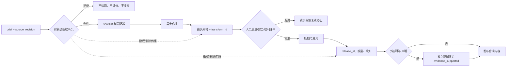

# 生成与后期拼接工作流

## 本节目标

将生成模型视为镜头素材供应环节，设计从任务提交到剪辑交接的状态、文件和失败边界。

## 一条可审计的生产管线

1. **锁定 brief**：用途、受众、比例、时长、权利、安全和预算，并冻结 `source_revision`。
2. **授权预检**：对象级授权/ACL、用途、保存期限和人物同意先通过；未通过的素材不进入预览、评分或模型调用。
3. **分镜预演**：用文字框或合法静帧确认节奏，不先做昂贵生成。
4. **逐镜头提交**：每个镜头有稳定 ID、请求哈希、参考资产清单和 `transform_id`。
5. **异步管理**：保存供应商 job ID；轮询或 webhook 更新状态。
6. **素材入库与评审**：检查 MIME、时长、宽高、帧率、音轨、哈希与来源元数据；通过后才进入 approved bin，失败只重试相关镜头。
7. **后期**：剪辑、转场、调色、字幕、配音、音效、混音和图形排版；每一步追加来源链。
8. **成片审查与发布**：音画同步、连续性、权利、安全、内容凭证与发布规格；人工批准后分配 `release_id`，事实性对外陈述另需 `evidence_supported`。

视频 API 通常是长任务。以 2026-07-22 访问的 OpenAI 官方页为例，创建后返回 job，再查询状态或通过 webhook 获知完成，最后下载内容；该页公告 Sora 2 Videos API **计划于 2026-09-24 关闭**，这是未来计划而非已发生状态。这说明业务层必须用自己的状态模型和适配器，不能把某供应商生命周期当永久契约。

## 文件与版本规则

建议命名 `project-shot-version-status.ext`，例如 `demo-S03-v02-approved.mp4`。同时保存机器可读 manifest：输入 `asset_id` / `source_revision` / 哈希、请求哈希、供应商 ID、生成时间、技术探测结果、`transform_id`、选用理由、后期链和 `release_id`。原始候选、代理文件、批准素材和成片分目录；不要用“final-final2”。

转码或拼接前先统一画布、帧率策略、像素格式、音频采样率和时间基准。直接把不同技术规格的文件串接，可能造成音画漂移或播放器兼容问题。FFmpeg 是常见工具，但命令需根据实际探测结果生成；本课程不对不存在的媒体执行命令。

## 幂等与失败恢复

客户端超时后先查询已保存的 job ID，避免重复创建。下载使用临时文件，校验后再原子改名。每个镜头有最大重试次数与停止标签；ACL、策略拒绝、权利缺失不自动重试。保留上一批准版本，新的编辑或延展失败时可回滚素材选择，而不是破坏原件。撤权/删除时，按 `asset_id → transform_id → release_id` 使镜头候选、代理文件、成片派生物、缓存和链接失效，同时保留合法需要的最小化审计记录。

## 常见错误与排查

- 只保存最终 MP4：丢失请求、输入和批准证据，无法复盘。
- webhook 重复触发：事件处理需幂等，以事件/作业状态去重。
- 生成与后期职责混淆：精确字幕、Logo、法律文案通常在后期处理。
- 全片失败后全部重做：以镜头为检查点恢复。
- 转码后来源断链：manifest 记录衍生关系和输出哈希。

## 练习与自测

画出 `planned → submitted → running → generated → reviewed → approved/rejected → edited → published` 状态图。为 webhook 重复、下载中断、技术规格不符和人工拒绝分别写恢复动作。

下一步：[[视频生成/02-工程与质量/06-音频字幕与无障碍接口|音频、字幕与无障碍接口]]。

## 参考资料

- [OpenAI Video generation guide](https://developers.openai.com/api/docs/guides/video-generation)（异步流程和未来关闭计划；核对/访问于 2026-07-22）
- [FFmpeg Documentation](https://ffmpeg.org/ffmpeg.html)（核对于 2026-07-22）
