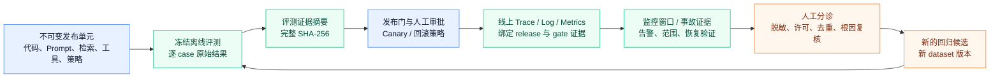

# 从离线证据到线上回归闭环

## 本节目标

把离线评测、发布门、Canary 观察、事故响应和回归数据连接成**单向、可复核且不泄露原始内容**的证据链。重点不是让监控自动改数据集，而是让每一次跨阶段交接都能回答“这条结论来自哪个版本、哪批证据、谁批准、下一步由谁处理”。

## 一条证据链，而不是一条自动写回管道

*图 1　离线—线上证据闭环。文字替代：发布单元先在冻结离线评测中产生完整摘要，经门禁和人工批准后进入Canary；线上遥测关联该发布与门禁证据；事故或漂移只产生待人工分诊的回归候选，经过脱敏、许可、去重和根因复核后才进入新数据集版本，旧冻结集不会被原地改写。图根据本节所列NIST、OpenTelemetry和MLflow资料整理，Mermaid源码即再生成方式。*

箭头的方向很重要。监控可以触发暂停、降级或回滚，也可以发现新的失败模式；但它不能因为某条线上日志“看起来很差”就自动修改 prompt、训练数据、评分阈值或冻结测试集。否则生产噪声、攻击输入和标签偏差会反向污染后续门禁。

## 四类交接物与身份边界

每个交接物至少有一个人可读的 ID 和一个机器可比的完整摘要；后者还必须绑定**摘要算法、字节表示/规范化规则和版本**，否则“同一JSON”在不同语言或序列化器中可能得到不同摘要：

1. **评测证据**：`release_id`、suite/dataset/rubric/grader/harness 版本、逐 case 结果和完整评测摘要（本仓库离线项目字段为`evidence_sha256`）。它回答“这个候选在什么离线契约下得到什么结果”。
2. **发布门证据**：候选与基线、策略、必要测试、回退清单和`candidate_gate_evidence_sha256`。它回答“谁在什么规则下允许了哪一个发布单元进入哪个范围”。
3. **运行证据**：时间窗、流量分配、控制组、release manifest、Trace/Log 引用、采样/覆盖率和监控审计的完整`evidence_sha256`。它回答“生产中观察到了什么，证据是否足以支持动作”；只有非 OK 场景生成回归候选时，才把同一值以`monitor_evidence_sha256`字段名带入该候选。
4. **回归候选**：最小化的现象、严重度、版本、受限的 Trace 引用、分诊状态、脱敏/授权记录和去重键。它还**不是**评测 case；只有评审完成后才成为新 dataset 版本的一部分。

短指纹（例如前 16 个十六进制字符）适合终端、告警摘要和人工核对；完整 SHA-256 只有在接收端知道并验证同一算法、版本和输入字节表示时，才可作为跨文件交接的变更检测引用。真实跨语言哈希或签名需求需显式交换原始字节，或另行采用并测试明确规范（例如 RFC 8785 的 JSON Canonicalization Scheme，JCS）；`python-json-sorted-utf8-v1`不是该规范，不能把“键排序”误称为通用 canonical JSON。两者都不是数字签名、授权令牌或来源真实性证明：攻击者可替换同时替换摘要，存储访问控制、签名/证明、批准记录和保留策略仍然独立必需。

## 本仓库的版本化教学摘要 profile

三个离线项目现在把`python-json-sorted-utf8-v1`明确用作**同一 Python 教学实现**的版本化字节 profile，并各自用相同固定 golden vector 锁定结果。它把传入值作为外层数组，以`ensure_ascii=False`、`sort_keys=True`、`separators=(",", ":")`、`allow_nan=False`序列化为 UTF-8 字节后计算 SHA-256；它不是 JCS、数字签名或制品来源证明。字段关系如下：

| 项目 | 格式声明或输出 | 交接边界 |
| --- | --- | --- |
| [[评测体系/03-项目与自测/08-项目-离线分层评测流水线\|离线分层评测流水线]] | stdout 的`evidence_digest_format`、`evidence_sha256`和显示用短指纹 | 摘要覆盖 evaluator 版本、dataset、rubric、predictions 和 candidate；真实执行器/制品来源并未由 fixture 证明。 |
| [[LLMOps/03-项目与自测/08-离线发布门项目与自测\|离线发布门项目]] | eval artifact 的`artifact_digest_format`、观察 bundle 顶层的`evidence_digest_format`及决策的`evidence_digest_format` | 它校验`candidate_gate_evidence_sha256`与短指纹的绑定；不读取外部 artifact 本体，也不证明其由上游实际重算。 |
| [[运行监控/03-项目与自测/08-离线监控审计项目与自测\|离线监控审计项目]] | `release_evidence.candidate_gate_evidence_digest_format`、决策的`evidence_digest_format`和回归候选的`monitor_evidence_digest_format` | 它保存上游格式引用并生成本窗口摘要；fixture 的 release evidence 仍是独立样例，而非真实 gate 输出。 |

三个实现的 JSON 输入契约都会把未知格式、重复键、非标准 JSON 常量、原始无效 UTF-8、孤立 surrogate 和无法表示为有限 `float` 的数字转为受控契约错误。相同的 golden vector 证明它们在这套受限 profile 下没有无意漂移；它**不**证明三个 fixture 的 64 位摘要来自同一次发布，也不检查真实系统是否实际沿链路传递了上游字节。相同长度、相同算法名甚至相同 JSON 对象都不足以证明可比或可信；真实系统应通过受控制品存储或 API 显式传递同一个已验证的字节对象（或明确采用版本化规范化方案），而不是人工复制文本。

## Trace 关联、Metric 基数和私密性

`trace_id`、release ID、门禁摘要和用户输入的用途不同：

- Trace / 结构化 Log 可以保存受控的 release 与证据引用，以便从事故下钻到发布决策；`traceparent`只传播关联，绝不充当认证或授权。
- Metric label 只能使用有限、预批准的枚举，例如`service`、`environment`、`status`；若使用`release`，它只能是受控且有限存续的部署 cohort，不能是 manifest/hash 或无限累积的 release ID。不能把 request ID、完整 SHA-256、用户 ID、会话 ID、Prompt、URL 或模型响应放进 label；它们会造成高基数、费用失控或隐私暴露。
- 原始 prompt、输出和工具返回值应默认不采集。确有调查必要时，在隔离访问域内按最小字段、脱敏、访问控制和短保留期处理；面向广泛 Dashboard 的记录只保留必要的计数、受控切片与不透明引用。

OpenTelemetry 将语义约定视为仪器化与分析工具之间的契约：Dashboard、告警和查询依赖字段名、单位和稳定性。当前核心 SemConv 页面为 1.43.0，但 GenAI 约定已迁到独立仓库；其仓库当前 README 声明的 schema URL 是`https://opentelemetry.io/schemas/gen-ai/1.42.0`。这两个版本**不能互相替代**。采用时必须记录实际 instrumentation 发出的 schema URL/修订与信号稳定性，并对采集端和消费端一起做兼容测试。不要把“OTel”当作字段永久稳定的保证。

## 决策和责任不能被一个分数代替

下表给出最小责任边界；同一人可以兼任，但职责与批准对象必须可审计。

| 角色 | 对什么负责 | 不能替代什么 |
| --- | --- | --- |
| 发布/产品所有者 | 声明、流量范围、用户影响和回滚取舍 | 不能自行把未知安全风险标为可接受 |
| 评测所有者 | 数据、grader、统计和结论有效性 | 不能用一次离线通过保证线上成功 |
| SRE / 运行值班 | SLO、告警、遏制、恢复与证据保全 | 不能把监控代理指标判为业务真值 |
| 安全、隐私与合规所有者 | 数据边界、事故披露、例外与保留 | 不能由 Trace 传播标识替代访问控制 |
| 人工分诊/审批者 | 回归候选、例外、批准范围和到期 | 不能只留下`approved=true`而不绑定证据与时间 |

NIST AI RMF 的 Govern、Map、Measure、Manage 是贯穿生命周期的迭代函数，而非按顺序一次完成的清单。NIST SP 800-61 Rev.3 同样把事件响应嵌入组织风险管理：恢复服务前后都要保留范围、遏制和验证证据。对 LLM 应用，这意味着“回滚命令成功”不等于用户影响已停止；已有写入、泄露或错误决策仍可能需要补救、通知或人工复核。

## 线上信号如何成为新的回归样本

建议使用以下不可跳过的流程：

1. 监控记录现象、时间窗、release/gate 证据、受控 Trace 引用、覆盖率和采样/标签限制；高风险时先停止扩大或回滚。
2. 分诊者复核是否是采集缺失、控制组不等价、标签延迟、外部依赖故障、攻击输入或真实产品失败。
3. 仅在权限、脱敏、最小化和许可满足时提取可复现的输入、初始环境、期望 outcome 和严重度；保留来源分类，不复制完整生产内容。
4. 对重复或同源失败按 family 去重；给候选 case 写确定性断言或人工/模型 rubric，并把未知项明确为未知。
5. 新建 dataset/rubric/grader 版本，重跑基线和候选；曲线出现比较边界时标注断点，不把新旧口径无标记地拼在一起。

MLflow 的当前资料能帮助理解产品选择，但不要混淆 API：`mlflow.models.evaluate()`用于经典 ML 的`EvaluationMetric`体系；GenAI/Agent 使用`mlflow.genai.evaluate()`与`Scorer`体系，两者不可互操作。其自动评测是按过滤与采样配置异步处理新 Trace/会话的 LLM judge 能力，当前不支持 code-based scorer；创建或启用judge时最多只回看一小时前的记录，而仅更新judge配置不会重评已评估 Trace。无论采用哪个工具，以上交接、版本、隐私和人工责任边界仍适用。

## 常见错误与排查

- **只保存短指纹**：保留完整摘要；短值只用于人读显示，且不应被当作认证。
- **将 release hash 设为 Metric label**：改放受限 Trace/Log 或 release 元数据，通过下钻关联。
- **线上差分直接覆盖离线分数**：分别报告离线冻结集、同期控制组和生产监控证据。
- **事故日志自动加入训练/回归集**：先脱敏、许可、分诊、去重和泄漏检查，再创建新版本。
- **回滚后立即关闭事件**：先验证用户 SLI、外部副作用、监控健康和数据边界；补救完成后再结束。

## 练习与自测

1. 为“RAG 客服 Agent”的 5% Canary 写出从离线`evidence_sha256`到`candidate_gate_evidence_sha256`再到`monitor_evidence_sha256`的最小记录，说明每个摘要覆盖哪些内容。
2. 解释为什么完整 SHA-256 仍不能证明审批者或制品来源真实；列出两项额外控制。
3. 一条线上质量告警同时伴随 30% Trace 丢失和标签延迟。哪些结论已证实，哪些只能形成回归候选？
4. 为什么`candidate_gate_evidence_sha256`适合 Trace/Log 下钻却不适合作为 Prometheus label？

## 小结与下一步

可靠闭环不是“监控发现问题就自动学习”，而是把版本化离线证据、受控发布、可解释运行证据和人工复核串成可撤销的决策链。接着完成 [[评测体系/03-项目与自测/08-项目-离线分层评测流水线|离线评测项目]]，再使用 [[LLMOps/03-项目与自测/08-离线发布门项目与自测|发布门项目]] 与 [[运行监控/03-项目与自测/08-离线监控审计项目与自测|监控审计项目]] 分别观察离线、发布和运行边界。

## 参考资料

- [NIST AI RMF Core](https://airc.nist.gov/airmf-resources/airmf/5-sec-core/)（核对于2026-07-22；Govern/Map/Measure/Manage贯穿生命周期）
- [NIST SP 800-61 Rev. 3](https://csrc.nist.gov/pubs/sp/800/61/r3/final)（2025-04；核对于2026-07-22）
- [OpenTelemetry Semantic Conventions 1.43.0](https://opentelemetry.io/docs/specs/semconv/)（核对于2026-07-22；GenAI已迁至独立仓库）
- [OpenTelemetry GenAI semantic conventions](https://github.com/open-telemetry/semantic-conventions-genai)（核对于2026-07-22；当前README声明schema URL为`gen-ai/1.42.0`，不能以核心SemConv页面版本替代）
- [OpenTelemetry Versioning and stability](https://opentelemetry.io/docs/specs/otel/versioning-and-stability/)（核对于2026-07-22；语义约定是仪器化与分析工具之间的契约）
- [MLflow classic model evaluation](https://mlflow.org/docs/latest/ml/evaluation)（核对于2026-07-22；与GenAI评测体系不可互操作）
- [MLflow automatic evaluation](https://mlflow.org/docs/latest/genai/eval-monitor/automatic-evaluations/)（核对于2026-07-22；Trace/会话的异步LLM judge与采样边界）
- [RFC 8785: JSON Canonicalization Scheme](https://www.rfc-editor.org/rfc/rfc8785.html)（哈希/签名需要不变的字节表示；该RFC是信息性文档，采用时仍须测试具体实现与互操作性）
