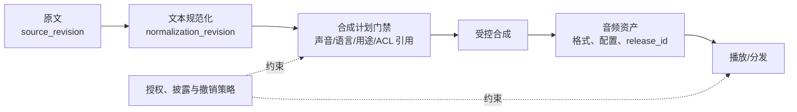

# 语音合成

## 知识库简介

语音合成（Text-to-Speech，TTS）把文本转为可听语音。工程上，它不是“给一句话选个声音”这么简单：输入要规范化，发音与韵律要可控，流式播放要处理延迟，声音要有授权，输出还要关联 `source_revision`、声音目录/策略版本、用途、访问范围、生成配置和发布状态。

本知识库从零解释文本规范化、音素、韵律、声学表示、声码器和端到端模型，再进入 SSML、服务工程、评测和克隆风险。动态资料已于 **2026-07-22** 核验；不同供应商只支持 SSML 子集，具体声音、参数、上传/流式行为和许可必须以目标版本的官方文档与合同为准。

## 在总路线中的位置

语音合成位于“扩展应用与复杂协作”阶段，是语音 Agent 的输出通道，通常接在 [[Agent 核心/00-目录|Agent 核心]] 或 [[工作流自动化/00-目录|工作流自动化]] 后；与 [[语音识别/00-目录|语音识别]] 形成输入/输出模块后，再由 [[实时多模态交互/00-目录|实时多模态交互]] 处理 turn、barge-in、低延迟传输和会话恢复。

`计划有效`、`已生成`、`可播放`、`已发布` 和 `已撤销` 是不同状态。离线计划中的 `acl_reference` 只保存待授权对象的引用；对象级 ACL 必须由外部身份/授权系统在生成、读取和发布前重新判定。尤其是已播放的声音无法被“撤回”，取消只能阻止后续生成或传输；实时 turn、打断和工具门禁见 [[实时多模态交互/00-目录|实时多模态交互]]。

## 学习目标

- 解释文本规范化、音素、韵律、声学表示和声码器的作用。
- 用 SSML 的稳定概念控制语言、分句、停顿、强调和发音，并处理方言差异。
- 设计声音选择、批处理、流式与缓存契约，声明 container、codec、采样率、声道和播放器兼容性。
- 组织自然度、可懂度、内容正确性、稳定性和偏好评测。
- 建立声音授权、克隆限制、披露、来源记录、撤销和滥用响应流程。
- 完成一个仅生成/校验合成计划与 SSML、绝不生成音频的离线项目。

## 前置知识

- 建议先学 [[Python基础/00-目录|Python 基础]]、[[JSON/00-目录|JSON]] 与 [[API/00-目录|API]]。
- 不要求语言学或信号处理基础；首次出现的术语会给出直觉解释。

## 推荐学习顺序

1. [[语音合成/01-基础与数据/01-TTS全流程与文本规范化|TTS 全流程与文本规范化]]：先把输入文本变成可朗读形式。
2. [[语音合成/01-基础与数据/02-音素韵律与声码器直觉|音素、韵律与声码器直觉]]：理解合成系统内部职责。
3. [[语音合成/01-基础与数据/03-数据与声音授权|数据与声音授权]]：在采集或选声音前建立权利边界。
4. [[语音合成/02-工程与质量/04-SSML与发音控制|SSML 与发音控制]]：安全地表达停顿、强调和读法。
5. [[语音合成/02-工程与质量/05-声音选择批处理与流式|声音选择、批处理与流式]]：构建可靠输出服务。
6. [[语音合成/02-工程与质量/06-质量可懂度延迟与评测|质量、可懂度、延迟与评测]]：从主客观指标验证体验。
7. [[语音合成/02-工程与质量/07-克隆风险披露与可追溯性|克隆风险、披露与可追溯性]]：建立授权和事件响应。
8. [[语音合成/03-项目与自测/08-项目-离线合成计划与SSML|项目：离线合成计划与 SSML]]：生成并校验不含音频的计划。

## 动手实践或项目入口

- 主项目：[[语音合成/03-项目与自测/08-项目-离线合成计划与SSML|离线合成计划与 SSML]]。
- 项目资产：[[语音合成/03-项目与自测/examples/build_tts_plan.py|计划生成器]]、[[语音合成/03-项目与自测/examples/tts_requests.json|合成请求夹具]]、[[语音合成/03-项目与自测/examples/test_contract_and_cli.py|合同与 CLI 回归测试]]。
- 项目仅使用 Python 3 标准库；输出状态明确写为 `not_generated`，不调用任何 TTS 服务，默认也不把输入原文或完整 SSML 回显到终端。

## 掌握标准

- [ ] 能区分文本规范化、发音建模、声学表示和声码器。
- [ ] 能解释音素、重音、语调、节奏和停顿如何影响可懂度。
- [ ] 能构造合法的基础 SSML，并识别供应商扩展的可移植性风险。
- [ ] 能设计首包延迟、实时率、内容正确性和人工听测方案。
- [ ] 能证明一个声音和训练/参考数据有明确授权、用途和撤销流程。
- [ ] 能运行离线项目，验证计划、SSML、来源字段和不生成音频的边界。

## 与其他知识库的关系

- 对话输入来自 [[语音识别/00-目录|语音识别]]，文本和语气上下文来自 [[上下文工程/00-目录|上下文工程]]。
- 用户打断时如何取消旧音频、关联工具结果并恢复 session，见 [[实时多模态交互/00-目录|实时多模态交互]]。
- 多媒体组合与同步见 [[多模态AI/00-目录|多模态 AI]] 和 [[视频生成/00-目录|视频生成]]。
- 滥用、隐私和组织责任连接 [[AI安全/00-目录|AI 安全]]、[[AI治理/00-目录|AI 治理]] 与 [[隐私计算/00-目录|隐私计算]]。

## 主要参考资料

以下资料于 **2026-07-22** 核验：

- [W3C Speech Synthesis Markup Language 1.1 Recommendation](https://www.w3.org/TR/speech-synthesis11/)（W3C Recommendation，2010-09-07；核验时仍是该规范最新入口）
- [W3C Pronunciation Lexicon Specification 1.0](https://www.w3.org/TR/pronunciation-lexicon/)（W3C Recommendation）
- [OpenAI Text to speech 指南](https://developers.openai.com/api/docs/guides/text-to-speech)（当前产品快照：一个供应商的流式能力与 AI 语音披露要求；不构成本课程的通用 API 或权利结论）
- [Natural TTS Synthesis by Conditioning WaveNet on Mel Spectrogram Predictions（Tacotron 2）](https://arxiv.org/abs/1712.05884)
- [FastSpeech 2: Fast and High-Quality End-to-End Text to Speech](https://arxiv.org/abs/2006.04558)
- [Conditional Variational Autoencoder with Adversarial Learning for End-to-End Text-to-Speech（VITS）](https://arxiv.org/abs/2106.06103)
- [ITU-T P.800：主观质量评价方法入口](https://www.itu.int/rec/T-REC-P.800)
- [NIST AI RMF Generative AI Profile（NIST AI 600-1）](https://www.nist.gov/publications/artificial-intelligence-risk-management-framework-generative-artificial-intelligence)（发布于 2024-07-26，页面更新于 2026-04-08）

> [!warning] 可移植性与授权
> W3C 规范定义语义，但引擎可能仅实现子集或加入私有扩展。声音列表中“可选”也不代表可用于任意场景；技术可用性、实际授权、同意、肖像/声纹等权利和内容披露必须分别核验。声音相似、声音目录中存在，或计划含有授权引用，都不能单独证明获得了许可。
