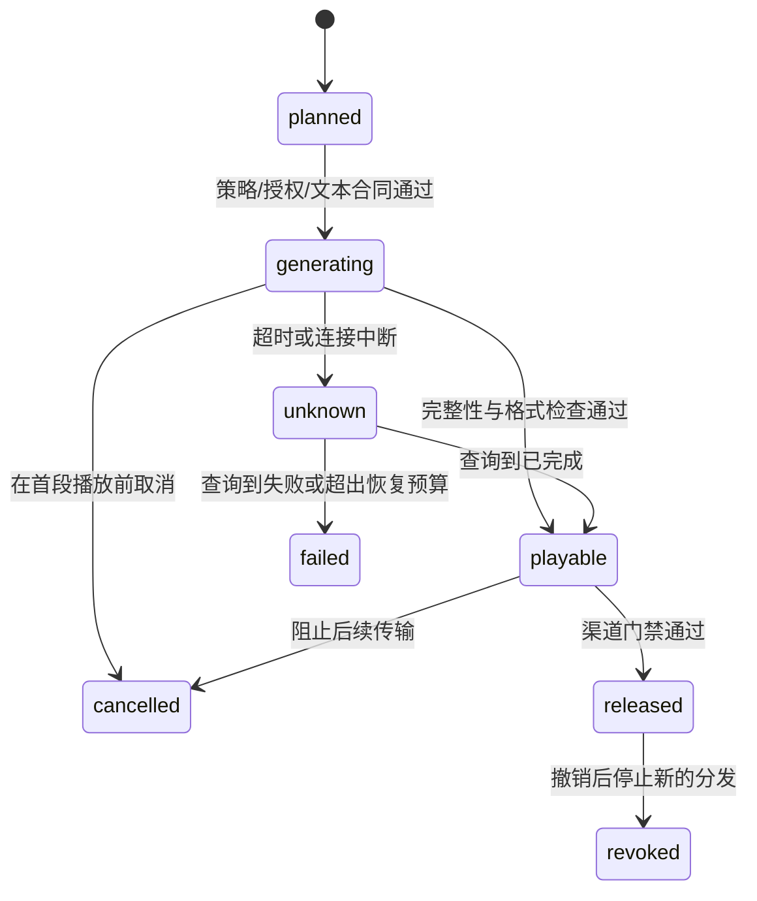

# 声音选择、批处理与流式

## 本节目标

按语言、授权和体验选择声音，并设计批处理、流式、缓存、取消与可靠重试。

## 声音选择契约

不要只用展示名选择声音；展示名可能重复或变更。内部记录稳定 `voice_id`、声音目录版本、供应源、明确支持的语言/地区、模型或版本、授权引用、允许用途、访问范围、质量状态与降级声音。所谓“男声/女声”等标签可能是供应商元数据，不应推断真实身份或适配性。

选择顺序可以是：用户明确选择且被授权 > 场景默认声音 > 同语言安全降级 > 文本显示。找不到合适声音时不应悄悄跨语言或模仿名人。`voice_id` 出现在目录、请求带有授权引用，最多证明它通过了本地结构/策略检查；现实权利、合同有效期和用户同意仍要在目录维护和审批流程中核验。

## 批处理与流式

批处理适合预生成课程、通知和无障碍材料，可统一质检和缓存。流式适合实时 Agent，关注：

- **首包延迟**：请求到第一段可播放音频的时间；
- **实时率（real-time factor）**：生成耗时 / 音频时长，小于 1 表示生成快于播放；
- 播放缓冲、网络抖动、取消和段间衔接；
- 文本尚未最终确定时是否允许开始播放。

流式一旦播放就不能“撤回用户听到的内容”。因此工具调用结果、金额或安全警告应在确认后再合成，不把 LLM 的未完成 token 直接外放。

为每个 `utterance_id` 定义明确终态，避免把网络故障当作“肯定没生成”：

`cancelled` 只能阻止尚未播放/发送的片段；`released` 或已播放的内容需要渠道通知、替换、撤销记录和用户支持，不能宣称已从听众记忆中删除。图中的“授权通过”在真实服务中应包含已认证主体、对象级 ACL、用途和当前策略的外部判定；离线计划里的 `acl_reference` 仅用于关联，不能作为该判定的替身。

每个可播放响应还应带上输出 contract：container、codec、采样率、声道、字节/时长、声音/模型/配置版本和 `release_id`（若已发布）。客户端必须显式协商或验证可播放格式；某个 API 的默认 MP3、分片事件或声音数量不是跨供应商保证。

## 缓存、幂等与重试

缓存键应包含规范化文本摘要、`source_revision`、声音目录版本、语言、SSML/发音规则版本、音频格式和模型版本；涉及个人数据时还要有保留/删除策略与访问范围。每个本地合成操作使用稳定 `operation_id` 做幂等与去重，有界重试；生成状态未知时先查询。实际供应商返回的 `provider_request_id` 应连同 provider、响应/receipt 另行记录，既不能替代本地 `operation_id`，也不能跨供应商拿来做幂等。不要在日志输出全文或音频 Base64，且文本散列仍可能被小词典猜中，不能当作匿名化。

## 练习与自测

- 为实时天气播报设计主声音和降级链。
- 若同文本换了模型版本，能否复用旧缓存？只有产品明确允许；否则版本应进入缓存键。
- 为什么低首包延迟仍可能卡顿？后续生成速度或网络吞吐不足。

## 下一步与参考

下一步学习 [[语音合成/02-工程与质量/06-质量可懂度延迟与评测|质量、可懂度、延迟与评测]]。声音和流式能力属于动态产品事实，接入前只使用目标供应商当前官方文档核验；例如 [OpenAI Text to speech 指南](https://developers.openai.com/api/docs/guides/text-to-speech) 在 2026-07-22 给出该服务的流式与披露要求，不能外推给其他实现。SSML 共同语义参考 [W3C SSML 1.1](https://www.w3.org/TR/speech-synthesis11/)。
