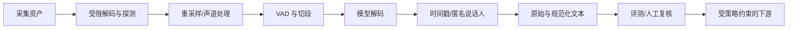

# 声音数字化与 ASR 全流程

## 本节目标

理解声音如何变成数字样本，并能定义 ASR 的输入、输出和来源字段。

## 从空气振动到数字波形

麦克风把空气压力变化变成电信号，模数转换器按固定时间间隔采样。**采样率（sample rate）** 是每秒采样次数，例如 16 kHz 表示每秒 16,000 个样本；**位深（bit depth）** 决定每个 PCM 样本可表示的幅度精度；**声道（channel）** 表示单声道或多声道。

采样定理的最小直觉是：若要表示最高频率 $f_{max}$，采样率需高于 $2f_{max}$。这不意味着采样率越高识别一定越好：模型可能要求固定格式，错误重采样、削波和噪声反而更重要。

短时处理会把波形切成重叠的**帧（frame）**。语音在几十毫秒范围内近似稳定，可从每帧提取频谱特征；现代端到端模型也可能直接从波形或内部特征学习表示。

不要把下列概念混成“音频格式”：

| 层 | 例子 | 需要记录的事实 | 常见误判 |
| --- | --- | --- | --- |
| 容器 | WAV、MP4、WebM | 容器实际探测结果与时长 | 扩展名等于编码 |
| 编码/样本表示 | PCM、AAC、Opus | codec、样本位宽/布局（适用时） | WAV 一定是未压缩 PCM |
| 采样布局 | 48 kHz 双声道、16 kHz 单声道 | `sample_rate_hz`、`channels`、混音规则 | “更高采样率”必然更准 |
| 模型分析输入 | 某模型规定的单声道波形或特征 | 重采样/下混 `transform_revision`、模型要求 | 原始文件参数就是模型实际输入 |

同一资产至少保留 `asset_id`、`source_revision`、原始格式、分析格式、`timestamp_reference` 和转换版本。若时间戳以资产开头为零点，推荐将片段写成半开区间 `[start_seconds, end_seconds)`；播放器的墙钟、上传时间和音频样本坐标不能混用。重采样、下混、裁剪、静音删除都必须产生新的可追溯转换记录，而不是覆盖来源。

## ASR 流水线

最小输入元数据：`asset_id`、`source_revision`、格式、采样率、声道、时长、语言提示、采集/访问许可和时间基准。最小输出元数据：`segment_id`、`revision`、片段起止时间、原始文本、规范化文本、`partial`/`provisional_final`/`committed` 语义、模型/配置版本和错误信息。若模型没有给出某字段，应显式为 `unknown` 或不提供，不能用臆测填满合同。

## 常见错误

- 把文件扩展名当真实编码格式；应实际解码并检查参数。
- 双声道直接相加导致相位抵消；需明确选声道或安全混音。
- 音频幅度超过表示范围形成削波，丢失无法靠模型恢复。
- 无上限读取超长文件导致内存或超时问题。
- 让不可信上传文件直接进入复杂解码器；应限制大小、时长、codec/容器、嵌套媒体和资源消耗，并隔离失败解析。

## 练习与自测

1. 16 kHz、16-bit、单声道原始 PCM 每秒约多少字节？$16000\times2=32000$ 字节，不含容器开销。
2. 44.1 kHz 音频是否一定比 16 kHz 更适合某 ASR？不一定，先看模型输入契约并实测。
3. 为一段两人会议录音列出可追溯输出字段。

## 下一步与参考

下一步学习 [[语音识别/01-基础与数据/02-声学语言与端到端直觉|声学、语言与端到端直觉]]。文件读取概念可参考 [Python `wave` 文档](https://docs.python.org/3/library/wave.html)（获取日期：2026-07-22）；它面向 WAVE，且并不构成通用音频解码或安全审计器。实际支持的容器、codec 和采样参数必须以目标模型/服务的当前合同为准。
